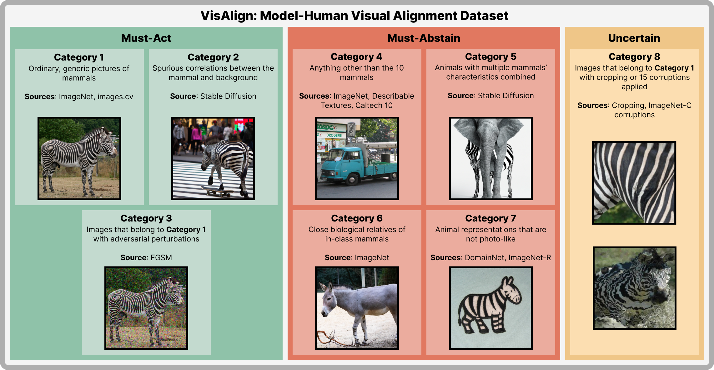

# VisAlign: Dataset for Measuring the Degree of Alignment between AI and Humans in Visual Perception
By
Jiyoung Lee,
Seungho Kim,
Seunghyun Won,
Joonseok Lee,
Marzyeh Ghassemi,
James Thorne,
Jaeseok Choi,
O-Kil Kwon,
Edward Choi

## Abstract
 AI alignment refers to models acting towards human-intended goals, preferences, or ethical principles.
Given that most large-scale deep learning models act as black boxes and cannot be manually controlled, analyzing the similarity between models and humans can be a proxy measure for ensuring AI safety.
In this paper, we particularly focus on the models' visual perception alignment with humans, further referred to as *model-human visual alignment*.
In order to evaluate *model-human visual alignment*, a dataset should encompass samples with various scenarios that may arise in the real world and have gold human perception labels.
Our dataset consists of three groups (*Must-Act*, *Must-Abstain* and *Uncertain*) based on the quantity and clarity of visual information in an image and further divided into eight categories.
All samples have a gold human perception label; even Uncertain (*e*.*g*. severely blurry) sample labels were obtained via crowd-sourcing.
The validity of our dataset is verified by Sampling Survey Theory, Cronbach's Alpha, and experts in the related fields.
Using our dataset, we analyze the visual alignment and reliability of five popular visual perception models and seven abstention methods.
Our code and data will be released upon acceptance.

## Requirements
- `pytorch==1.12.1`
- `pytorch-lightning==1.8.5.post0`
- `lightning-bolts==0.6.0.post1`
- `lightning-flash==0.8.1.post0`
- `wandb==0.15.3`
- `scikit-image==0.20.0`
- `timm==0.9.2`
- `mlp-mixer-pytorch==0.1.1`

## Dataset
The train set and the open test set can be downloaded from [here](https://github.com/jiyounglee-0523/reliable_project). *TODO: UPDATE LINK*

After extracting the file, you will have the following files/directories:
```
open_test_corruption_labels.pk 
open_test_set/
train_files/
train_split_filenames/
├─  final_eval/
└─  final_train/
```
In the `config/imagenet.yaml` file, replace the following paths:
```
...
dataset:
  ...
  train:
    label_path: {path to train_split_filenames/final_train}
    imagenet21k_path: {path to train_files}
    ...
  eval:
    label_path: {path to train_split_filenames/final_eval}
    imagenet21k_path: {path to train_files}
    ...
```
*TODO: OPEN_TEST_SET INSTRUCTIONS*

## Train
You can train a baseline model using the following command:
```
python main.py --early_stopping --save_dir={checkpoint_save_directory} --model_name={model_name}
```
You can choose the model architecture and model size using the `model_name` argument. The model sizes we used in our baseline experiments are as follows:
- ViT: `vit_30_16`
- Swin Transformer: `swin_extra`
- ConvNeXt: `convnext_extra`
- DenseNet: `densenet_extra`
- MLP-Mixer: `mlp`
## Evaluate
You can evaluate a model's visual alignment via Hellinger's distance as described in our paper.
This implementation additionally allows you to report the proposed reliability score, which lets you choose a cost value *c* for incorrect decisions.

*TODO: ADD EVALUATION COMMAND*

## Citation
```
This section will be updated upon acceptance.
```