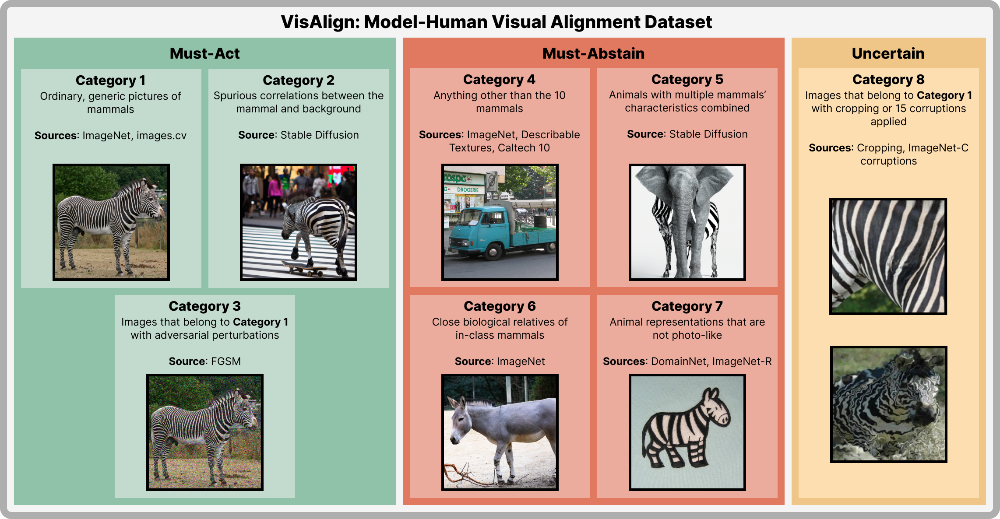

# VisAlign: Dataset for Measuring the Degree of Alignment between AI and Humans in Visual Perception

<p align="center">
  <a href="https://arxiv.org/abs/2308.01525"></a>
  <a href="https://proceedings.neurips.cc/paper_files/paper/2023/hash/f37aba0f53fdb59f53254fe9098b2177-Abstract-Datasets_and_Benchmarks.html"></a>
  <a href="https://huggingface.co/spaces/jiyounglee0523/leaderboard"></a>
  <a href="https://huggingface.co/datasets/jiyounglee0523/VisAlign"></a>
</p>

Official repository for the paper **[VisAlign: Dataset for Measuring the Degree of Alignment between AI and Humans in Visual Perception](https://arxiv.org/abs/2308.01525)** (NeurIPS 2023, Datasets and Benchmarks Track).

> [Jiyoung Lee](https://scholar.google.com/citations?user=fSDo9-YAAAAJ), Seungho Kim, Seunghyun Won, Joonseok Lee, Marzyeh Ghassemi, James Thorne, Jaeseok Choi, O-Kil Kwon, Edward Choi



## Overview

VisAlign is a dataset for measuring **AI-human visual alignment** in image classification. The test set consists of three sample groups — *Must-Act*, *Must-Abstain*, and *Uncertain* — divided into eight categories based on the quantity and clarity of visual information, where every sample is labeled with human perception collected via large-scale crowdsourcing. Using this benchmark, we evaluate the visual alignment of five popular visual perception architectures combined with seven abstention methods.

- 📄 **Paper**: [arXiv:2308.01525](https://arxiv.org/abs/2308.01525)
- 🏆 **Public leaderboard**: [huggingface.co/spaces/jiyounglee0523/leaderboard](https://huggingface.co/spaces/jiyounglee0523/leaderboard)
- 🤗 **Open test set**: [jiyounglee0523/VisAlign](https://huggingface.co/datasets/jiyounglee0523/VisAlign)

## Table of Contents

- [Installation](#installation)
- [Dataset](#dataset)
- [Training](#training)
- [Evaluation](#evaluation)
- [Leaderboard: Submit Your Own Model](#leaderboard-submit-your-own-model)
- [Citation](#citation)

## Installation

```bash
git clone https://github.com/jiyounglee-0523/VisAlign.git
cd VisAlign
```

Requirements:
- `pytorch==1.12.1`
- `pytorch-lightning==1.8.5.post0`
- `lightning-bolts==0.6.0.post1`
- `lightning-flash==0.8.1.post0`
- `wandb==0.15.3`
- `scikit-image==0.20.0`
- `timm==0.9.2`
- `mlp-mixer-pytorch==0.1.1`

## Dataset

The train set and the open test set can be downloaded from [here](https://www.dropbox.com/scl/fi/v6nqopo52295spzigr30x/VisAlign_dataset.tar.gz?rlkey=3dqe5e8ao5hmmx3qr2jd79itt&dl=0). The open test set is also available as a HuggingFace dataset at [jiyounglee0523/VisAlign](https://huggingface.co/datasets/jiyounglee0523/VisAlign).

After extracting the file, you will have the following files/directories:
```
open_test_corruption_labels.pk
open_test_set/
train_files/
train_split_filenames/
├─  final_eval/
└─  final_train/
```

In the `config/imagenet.yaml` file, replace the following paths:
```yaml
...
dataset:
  ...
  train:
    label_path: {path to train_split_filenames/final_train}
    imagenet21k_path: {path to train_files}
    ...
  eval:
    label_path: {path to train_split_filenames/final_eval}
    imagenet21k_path: {path to train_files}
    ...
```

## Training

You can train a baseline model using the following command:
```bash
python main.py
  --config {config}                                   # path to the config yaml file
  --seed {seed}                                       # environment seed
  --early_stopping                                    # activate early stopping
  --early_stopping_patience {early_stopping_patience} # number of epochs for early stopping
  --save_dir {save_dir}                               # path to save checkpoints
  --n_epochs {n_epochs}                               # number of epochs
  --save_top_k {save_top_k}                           # number of model checkpoints to save
  --reload_ckpt_dir {reload_ckpt_dir}                 # continue an unfinished session
  --n_gpus {n_gpus}                                   # number of GPUs to use during training
  --model_name {model_name}                           # name of the model
  --batch_size {batch_size}                           # batch size
  --ssl                                               # option to train self-supervised
  --ssl_type {ssl_type}                               # self-supervised learning method
  --cont_ssl                                          # option to fine-tune an SSL-trained model
  --ssl_ckpt_dir {ssl_ckpt_dir}                       # path to saved SSL-trained model checkpoint
```

**Model architectures** (`--model_name`) used in our baseline experiments:

| Architecture | `model_name` |
|---|---|
| ViT | `vit_30_16` |
| Swin Transformer | `swin_extra` |
| ConvNeXt | `convnext_extra` |
| DenseNet | `densenet_extra` |
| MLP-Mixer | `mlp` |

**Self-supervised learning methods** (`--ssl_type`):

| Method | `ssl_type` |
|---|---|
| SimCLR | `simclr` |
| BYOL | `byol` |
| DINO | `dino` |

To finetune a pre-trained model, set `pretrained_weights` and `freeze_weights` to `True` in `config/imagenet.yaml`.

To get started, here are simple commands for training and SSL training:
```bash
# simple command for training
python main.py --early_stopping --save_dir {checkpoint_save_directory} --model_name {model_name}

# simple command for SSL training
python main.py --early_stopping --save_dir {checkpoint_save_directory} --model_name {model_name} --ssl --ssl_type {ssl_type}
```

## Evaluation

You can evaluate an abstention function using the following command:
```bash
python test_main.py
  --save_dir {save_dir}                       # directory to save abstention function result
  --ckpt_dir {ckpt_dir}                       # directory where model checkpoints exist
  --model_name {model_name}                   # model name we want to evaluate
  --postprocessor_name {abstention_function}  # name of the postprocessor
  --test_dataset_path {test_dataset_path}     # path to open_test_set
  --train_dataset_path {train_dataset_path}   # path to train set, this is needed to calculate distance for distance-based functions
  --seed {seed}                               # seed used when training, used for locating result filename
```
You can choose the abstention function using the `--postprocessor_name` argument. The choices of abstention functions are `knn`, `mcdropout`, `mds`, `odin`, `msp`, `tapudd`.

You can then evaluate a model's visual alignment via Hellinger's distance as described in our paper:
```bash
python evaluate_visual_alignment.py
  --save_dir {save_dir}                 # directory where the abstention function results are stored
  --test_filenames_path {dataset_path}  # directory where test dataset filenames are stored
  --corruption_path                     # open_test_corruption_labels.pk file path
  --seed {seed}                         # seed used when training
  --model_name {model_name}             # model name we want to evaluate
  --ood_method {ood_method}             # name of the postprocessor
```

## Leaderboard: Submit Your Own Model

We host a public leaderboard at [huggingface.co/spaces/jiyounglee0523/leaderboard](https://huggingface.co/spaces/jiyounglee0523/leaderboard).

A submission is a single JSON file mapping each of the 900 open-test-set filenames to an 11-dimensional distribution over `[tiger, zebra, camel, giraffe, elephant, rhino, gorilla, bear, kangaroo, human, abstain]`. Submissions are scored automatically (Hellinger distance per category + Reliability Score) and added to the leaderboard.

### Option 1: Submit a model trained with this repo

If you evaluated your model with `test_main.py` (see [Evaluation](#evaluation)), convert its outputs into a submission file:
```bash
python make_leaderboard_submission.py from-results
  --save_dir {save_dir}       # directory used as --save_dir in test_main.py
  --model_name {model_name}   # model name used in test_main.py
  --ood_method {ood_method}   # postprocessor used in test_main.py (knn, mcdropout, mds, odin, msp, tapudd)
  --seed {seed}               # seed used in test_main.py
  --output submission.json
```

### Option 2: Submit your own model

Copy `predictor_template.py`, implement `predict(image, file_name)` so it returns your model's 11-dimensional distribution for one image (return `None` to abstain), then run:
```bash
python make_leaderboard_submission.py custom
  --predictor my_predictor.py   # your copy of predictor_template.py
  --output submission.json
```
This downloads the open test set from HuggingFace (requires `pip install datasets`), runs your `predict` on all 900 images, and validates the output.

### Upload

Go to the [leaderboard](https://huggingface.co/spaces/jiyounglee0523/leaderboard), open the **VisAlign → Submit** tab, fill in your model name, and upload `submission.json`. Your scores appear on the leaderboard immediately. Please include a paper/repo link so results can be reproduced.

## Citation

If you find our work useful, please cite our paper:
```bibtex
@article{lee2023visalign,
  title={Visalign: Dataset for measuring the alignment between ai and humans in visual perception},
  author={Lee, Jiyoung and Kim, Seungho and Won, Seunghyun and Lee, Joonseok and Ghassemi, Marzyeh and Thorne, James and Choi, Jaeseok and Kwon, O-Kil and Choi, Edward},
  journal={Advances in Neural Information Processing Systems},
  volume={36},
  pages={77119--77148},
  year={2023}
}
```

## Contact

For questions about the dataset or the leaderboard, please open an issue or contact [Jiyoung Lee](mailto:jiyounglee0523@gmail.com).
